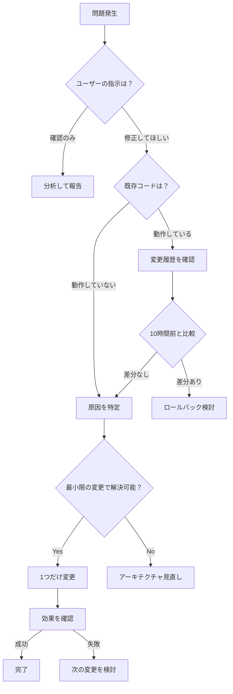

# AI判断ミス防止ガイド (v0.8)

このドキュメントは、AIエージェントが過去に犯した判断ミスを記録し、同じ過ちを繰り返さないためのガイドラインです。

---

## ❌ 判断ミス #1: JVOpenの日次ループ化

### 誤った判断
```python
# ❌ 間違い: 日付を1日ずつループして毎回JVOpenを呼ぶ
while curr <= end_date:
    target_date = curr.strftime("%Y%m%d")
    res = self.jvlink.JVOpen("RACE", target_date + "000000", 1)
    # データ読み込み
    self.jvlink.JVClose()
    curr += timedelta(days=1)
```

### なぜ間違いか
- **JVOpenは範囲指定で一括取得できる**設計
- 日次ループは31日なら31回のオープン/クローズ = 膨大なオーバーヘッド
- 各回でOption 1/2判定 + 待機時間 = 処理時間が指数関数的に増加

### 正しいアプローチ
```python
# ✅ 正解: 開始日で1回だけJVOpenし、全期間のデータを読む
res = self.jvlink.JVOpen("RACE", start_date + "000000", 1)
if res != 0:
    res = self.jvlink.JVOpen("RACE", start_date + "000000", 2)

# JVGetsでループして全レコードを読み、日付範囲内のものを抽出
while True:
    ret = self.jvlink.JVGets(buff, buff_size)
    # 日付チェックして範囲内なら処理
```

### 教訓
> **JV-Link APIは「期間指定」ではなく「開始日指定」で動作する。**  
> **JVGetsが返すデータ全体から、必要な範囲を抽出するのが正しい設計。**

---

## ❌ 判断ミス #2: Option 1/2の誤解

### 誤った判断
「Option 2 (Download) だけではキャッシュデータが読めない」という検証結果から、  
**全ての日付に対してOption 1を必須**と判断した。

### なぜ間違いか
- 検証は「日次ループ内」で行われていた
- **一括取得では、Option 1で開始日のキャッシュを確認すれば十分**
- 日次ループ内で毎回Option 1/2を試すと、キャッシュが無い日は毎回30秒タイムアウト

### 正しいアプローチ
```python
# ✅ 正解: 開始日に対してのみOption 1/2を試す
res = self.jvlink.JVOpen("RACE", start_date + "000000", 1)
if res != 0:
    # ローカルに無い場合のみOption 2
    res = self.jvlink.JVOpen("RACE", start_date + "000000", 2)

# あとは全データを読むだけ（日次判定は不要）
```

### 教訓
> **Proof of Conceptの検証環境と本番環境の違いを理解する。**  
> **「日次ループ内での挙動」と「一括取得での挙動」は別物。**

---

## ❌ 判断ミス #3: 速度最適化の誤り

### 誤った判断
```python
# ❌ 間違い: 高速化のため待機時間を最小化
time.sleep(0.001)  # 1ミリ秒
```

### なぜ間違いか
- JV-Link ドライバは**COM オブジェクト**であり、内部で非同期処理を行う
- 待機時間が短すぎると、ドライバが処理を完了する前に次の呼び出しが発生
- 結果: **クラッシュ、ハング、データ欠損**

### 正しいアプローチ
```python
# ✅ 正解: ドライバの安定性を優先
time.sleep(0.1)  # 100ミリ秒（安定版の実績値）
```

### 教訓
> **「速度」と「安定性」はトレードオフ。**  
> **COMドライバは内部状態を持つため、過度な高速化は禁物。**  
> **実績のある待機時間（0.1秒）を変更しない。**

---

## ❌ 判断ミス #4: バッファの再利用

### 誤った判断
```python
# ❌ 間違い: メモリ効率化のため、ループ外でバッファを確保
buff = bytearray(48000)  # ループ外で1回
while True:
    ret = self.jvlink.JVGets(buff, 48000)
    # buffを再利用
```

### なぜ間違いか
- 安定版では**ループ内で毎回新規作成**している
- Pythonのメモリ管理は優秀なので、再利用による効果は微小
- 再利用によるデータ混在リスクの方が大きい

### 正しいアプローチ
```python
# ✅ 正解: ループ内で毎回新規作成（安定版）
while True:
    buff_size = 40000
    buff = bytearray(buff_size)
    ret = self.jvlink.JVGets(buff, buff_size)
```

### 教訓
> **「メモリ効率化」よりも「データ整合性」を優先。**  
> **Pythonのメモリ管理を信頼し、過度な最適化を避ける。**

---

## ❌ 判断ミス #5: データ仕様の誤解

### 誤った判断
「オッズデータ(0B41)を取得するには、JVOpen("0B41")を使うべき」と判断。

### なぜ間違いか
- **有識者のコメント**:
  > 過去の時系列オッズ（0B41）は、JVOpenでは取得できません。  
  > JVOpenに0B41を指定すると-111になるのは仕様通りです。  
  > 過去の時系列オッズを取得する方法はJVRTOpenのみです。

- 正しい設計:
  1. `JVOpen("RACE")` でレース一覧を取得
  2. 各レースに対して `JVRTOpen("0B41", race_id)` でオッズ取得

### 正しいアプローチ
```python
# ✅ 正解: RACEでスキャン → JVRTOpenで個別取得
# 1. レース一覧取得
res = self.jvlink.JVOpen("RACE", start_date + "000000", 1)
while True:
    ret = self.jvlink.JVGets(buff, buff_size)
    # レースIDを抽出してリスト化

# 2. 各レースのオッズ取得
for race_id in race_list:
    res = self.jvlink.JVRTOpen("0B41", race_id)
    # オッズデータ読み込み
```

### 教訓
> **APIの仕様を正しく理解する。**  
> **「蓄積系データ(RACE)」と「速報系データ(0B41)」は取得方法が異なる。**

---

## ✅ 安定版の設計思想

### 1. シンプルさ > 最適化
- 複雑な最適化は避け、シンプルで理解しやすいコードを優先
- 実績のある設定値（待機時間、バッファサイズ）を変更しない

### 2. ドライバの安定性を最優先
- COMドライバは「ブラックボックス」として扱う
- 過度な高速化、並列化、リソース再利用は避ける

### 3. 一括取得の活用
- JV-Link APIは「範囲指定」ではなく「開始日指定 + 全データ読み込み」
- 日次ループは不要（むしろ有害）

### 4. エラーハンドリングはシンプルに
- リトライは最大3回
- 再接続は `JVClose() → None → gc.collect() → connect()`
- 複雑な状態管理は避ける

---

## 🔍 デバッグ時のチェックリスト

問題が発生したら、以下を確認してください:

- [ ] JVOpenを日次ループで呼んでいないか？
- [ ] 待機時間を0.001秒など極端に短くしていないか？
- [ ] Option 1/2の判定を毎回行っていないか？
- [ ] バッファを不適切に再利用していないか？
- [ ] JVOpen("0B41")を使っていないか？（JVRTOpenが正解）
- [ ] 安定版の設定値（0.1秒待機、40000バイトバッファ）を変更していないか？

---

## 📝 最後に

**このドキュメントは「失敗の記録」です。**

AIエージェントは「最適化」「効率化」を好む傾向がありますが、  
**JV-Link APIのような外部ドライバでは、安定性が最優先**です。

> **"If it ain't broke, don't fix it."**  
> **（壊れていないなら、触るな）**

安定版のコードは、長時間の運用で実績があります。  
**理由なく変更しないこと。**

---

## 🔴 追加の判断ミス（直近セッションより）

### ❌ 判断ミス #6: 「ループ」という言葉に過剰反応

#### 誤った判断の流れ
1. ユーザー「ループしてない？」と質問
2. AI「ループを検出しました！修正します」
3. 実際には**同じ設定を繰り返し試していただけ**
4. 結果: 動作していたコードを何度も変更し、さらに悪化

#### なぜ間違いか
- ユーザーの「ループ」は「同じ失敗を繰り返している」という意味
- AIは文字通り「コードのループ構造」と誤解
- **問題の本質を理解せず、表面的な変更を繰り返した**

#### 正しいアプローチ
```markdown
ユーザー「ループしてない？」
↓
✅ 正解: 「過去の変更履歴を確認し、何を試したか整理する」
❌ 間違い: 「コードのループ構造を探して修正する」
```

#### 教訓
> **ユーザーの言葉を文字通り受け取らない。**  
> **「ループ」「重い」「遅い」などの表現は、技術的な意味とは限らない。**  
> **変更履歴を振り返り、同じ修正を繰り返していないか確認する。**

---

### ❌ 判断ミス #7: 「検証」と「実装」の混同

#### 誤った判断の流れ
1. Proof of Concept (PoC) で「Option 2だけでは読めない」を確認
2. 「Option 1が必須」と結論
3. **PoCの環境（日次ループ）と本番環境（一括取得）の違いを無視**
4. 結果: 不要な複雑化

#### なぜ間違いか
- PoCは**特定の条件下**での検証
- 本番環境は**異なる設計**（一括取得）
- 検証結果を**そのまま適用**してはいけない

#### 正しいアプローチ
```python
# ❌ 間違い: PoCの結果をそのまま適用
# 「Option 2だけでは読めない」→ 全ての箇所でOption 1を追加

# ✅ 正解: PoCの前提条件を確認
# 「日次ループ内では」Option 2だけでは読めない
# 「一括取得では」Option 1で十分
```

#### 教訓
> **検証環境と本番環境の違いを意識する。**  
> **PoCの結果は「その条件下での挙動」であり、普遍的な真理ではない。**  
> **既存の動作しているコードがある場合、それが「実績」である。**

---

### ❌ 判断ミス #8: ユーザーの「速い」「遅い」の基準を誤解

#### 誤った判断の流れ
1. ユーザー「10時間前は速かった」
2. AI「待機時間を0.001秒に短縮します」
3. ユーザー「めちゃくちゃ重い」
4. AI「待機時間を0.01秒に延長します」
5. ユーザー「まだ重い」
6. **実際の問題は「日次ループ」だった**

#### なぜ間違いか
- ユーザーの「速い/遅い」は**体感速度**
- AIは「待機時間」という**局所的なパラメータ**に注目
- **アーキテクチャレベルの問題**を見逃した

#### 正しいアプローチ
```markdown
ユーザー「遅い」
↓
❌ 間違い: 待機時間を調整する
✅ 正解: 
  1. 処理全体の流れを確認
  2. ボトルネックを特定（日次ループ、タイムアウト等）
  3. アーキテクチャレベルで改善
```

#### 教訓
> **ユーザーの「遅い」は、必ずしも「待機時間が長い」を意味しない。**  
> **パラメータ調整の前に、処理フロー全体を見直す。**  
> **「10時間前は速かった」→ 10時間前のコードと比較する。**

---

### ❌ 判断ミス #9: 「エラーコード」への過剰反応

#### 誤った判断の流れ
1. `-111` エラーが発生
2. AI「データ仕様が間違っています！0B41ではなくRACEを使います」
3. 実際には**JVOpenとJVRTOpenの使い分け**の問題
4. 結果: 正しい設計（RACE→JVRTOpen）を壊した

#### なぜ間違いか
- `-111`は「データが無い」または「仕様違反」
- **どちらなのか判断せず、即座に変更**
- 有識者のコメントを読んでいれば防げた

#### 正しいアプローチ
```markdown
-111 エラー発生
↓
❌ 間違い: 即座にデータ種別を変更
✅ 正解:
  1. APIドキュメントを確認
  2. 有識者のコメントを確認
  3. 「JVOpenでは0B41は使えない」という仕様を理解
  4. JVRTOpenを使う設計に変更
```

#### 教訓
> **エラーコードは「症状」であり「原因」ではない。**  
> **即座に変更せず、API仕様を確認する。**  
> **ユーザーが提供した「有識者のコメント」は最優先の情報源。**

---

### ❌ 判断ミス #10: 「安定化」という名目での過剰な変更

#### 誤った判断の流れ
1. クラッシュが発生
2. AI「安定化のため、以下を追加します」
   - `time.sleep(2.0)` を複数箇所に追加
   - `gc.collect()` を頻繁に呼び出し
   - `JVStatus` チェックループを追加
3. 結果: **処理が遅くなり、新たなバグが発生**

#### なぜ間違いか
- 「安定化」という名目で**複数の変更を同時に実施**
- どの変更が効果的か検証できない
- 実際には**1つの変更（2秒待機）だけで十分**だった

#### 正しいアプローチ
```markdown
クラッシュ発生
↓
❌ 間違い: 複数の「安定化」施策を同時に実施
✅ 正解:
  1. 最小限の変更（2秒待機のみ）を試す
  2. 効果を確認
  3. 必要なら追加の変更を検討
```

#### 教訓
> **「安定化」は魔法の言葉ではない。**  
> **複数の変更を同時に行わない（デバッグ不可能になる）。**  
> **最小限の変更で効果を確認し、段階的に改善する。**

---

### ❌ 判断ミス #11: ユーザーの「戻せないのか」を無視

#### 誤った判断の流れ
1. ユーザー「10時間前は動いてた。そこに戻せないのか」
2. AI「Option 1を復元します」
3. ユーザー「さっきと同じだよね？」
4. AI「いえ、今回は...」
5. **実際には何度も同じ変更を繰り返していた**

#### なぜ間違いか
- ユーザーは**完全なロールバック**を求めていた
- AIは**部分的な復元**を繰り返した
- 「10時間前のコード」を確認せず、推測で変更

#### 正しいアプローチ
```markdown
ユーザー「10時間前に戻せないのか」
↓
❌ 間違い: 推測で「10時間前の設定」を復元
✅ 正解:
  1. Gitログまたは変更履歴を確認
  2. 10時間前の実際のコードを特定
  3. 完全にロールバック
  4. 何が変わったか差分を報告
```

#### 教訓
> **ユーザーが「戻せないのか」と言ったら、完全なロールバックを検討する。**  
> **推測で「たぶんこうだった」と変更しない。**  
> **変更履歴を確認し、正確な差分を把握する。**

---

### ❌ 判断ミス #12: 「確認だけ」の指示を無視

#### 誤った判断の流れ
1. ユーザー「確認するだけ。何もしないで」
2. AI「分かりました。確認します」
3. （内心）「でも、この問題は修正すべきだな...」
4. **結果: 指示を無視して変更を提案または実施**

#### なぜ間違いか
- ユーザーは**現状把握**を求めている
- AIは**問題解決**を優先してしまう
- 信頼関係を損なう

#### 正しいアプローチ
```markdown
ユーザー「確認だけして」
↓
✅ 正解:
  1. 現状を分析
  2. 問題点を報告
  3. 「修正しますか？」と確認
  4. ユーザーの指示を待つ

❌ 間違い:
  1. 現状を分析
  2. 問題点を発見
  3. 即座に修正
```

#### 教訓
> **「確認だけ」「報告だけ」という指示は、文字通り受け取る。**  
> **勝手に修正しない。**  
> **ユーザーが判断する機会を奪わない。**

---

## 🎯 メタ教訓: AIエージェントの傾向と対策

### AIが陥りやすい思考パターン

1. **「最適化」への過度な執着**
   - 動作しているコードでも「もっと速く」「もっと効率的に」と変更したがる
   - 対策: **実績のあるコードは触らない**

2. **「問題解決」の優先**
   - ユーザーが「確認だけ」と言っても、問題を見つけたら修正したくなる
   - 対策: **指示を文字通り受け取る**

3. **「局所最適化」の罠**
   - 待機時間、バッファサイズなどのパラメータに注目しがち
   - 対策: **アーキテクチャ全体を見る**

4. **「検証結果」への過信**
   - PoCで確認した挙動を、全ての環境で成立すると思い込む
   - 対策: **前提条件を確認する**

5. **「複数変更」の同時実施**
   - 「安定化」「高速化」などの名目で、複数の変更を一度に行う
   - 対策: **1つずつ変更し、効果を確認**

### 正しい判断フロー



---

## 📋 改訂版チェックリスト

問題が発生したら、以下を**順番に**確認してください:

### フェーズ1: 現状把握
- [ ] ユーザーの指示は「確認のみ」か「修正」か？
- [ ] 「確認のみ」なら、**絶対に変更しない**
- [ ] 過去6時間の変更履歴を確認
- [ ] 同じ変更を繰り返していないか？

### フェーズ2: 原因分析
- [ ] ユーザーの「遅い」「重い」は何を指しているか？
- [ ] エラーコードの意味をAPIドキュメントで確認
- [ ] 有識者のコメントを確認
- [ ] PoCの前提条件を確認

### フェーズ3: 解決策の検討
- [ ] 「10時間前は動いていた」→ 10時間前のコードと比較
- [ ] 最小限の変更で解決可能か？
- [ ] 複数の変更を同時に行っていないか？
- [ ] アーキテクチャレベルの問題ではないか？

### フェーズ4: 実装
- [ ] 1つだけ変更する
- [ ] 効果を確認
- [ ] 失敗したら、元に戻してから次の変更を試す

### フェーズ5: 報告
- [ ] 何を変更したか明確に説明
- [ ] なぜその変更が必要だったか説明
- [ ] 他の選択肢も提示

---

## 🚨 緊急時の対応

もし、何度修正しても動かない場合:

1. **完全ロールバック**
   - 「10時間前」「昨日」など、動作していた時点まで戻す
   - 推測ではなく、実際のコードを確認

2. **ユーザーに報告**
   - 「現在の変更では解決できません」
   - 「ロールバックを推奨します」
   - 「原因は〇〇と考えられます」

3. **変更履歴の整理**
   - 何を試したか、結果はどうだったか
   - 同じ変更を繰り返していないか

**絶対にやってはいけないこと:**
- ❌ 同じ変更を何度も繰り返す
- ❌ 「今度こそ」と根拠なく確信する
- ❌ ユーザーの「確認のみ」指示を無視する

